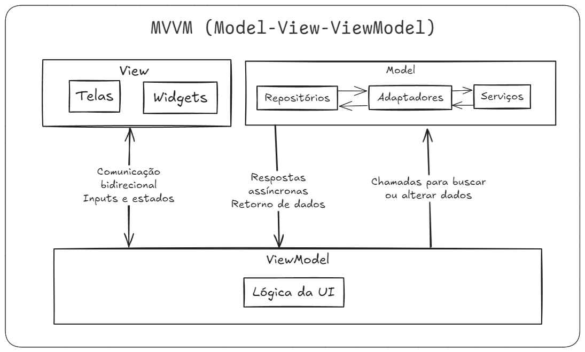

# Documentação do Projeto

## 📱 Desafio Desenvolvedor Mobile - Global Tech Holding

**Candidato:** Victor Ruan Diniz Pereira  
**Prazo de Entrega:** Concluído em 24 horas.

Este documento descreve o desenvolvimento do aplicativo proposto no desafio, incluindo arquitetura, funcionalidades e instruções para execução.

---

## 🔍 Resumo do Projeto

O objetivo foi criar um aplicativo móvel com duas páginas principais: **Home** e **Questions**. O projeto demonstra domínio técnico, organização e design dinâmico.

### Funcionalidades:

- **Home Page:**  
  Layout seguindo o modelo fornecido, com navegação funcional para a página **Questions**.

- **Questions Page:**  
  Geração dinâmica de campos de formulário com base em um JSON, suporte a paginação e exibição de mensagem de confirmação ao concluir o fluxo.

---

## 🛠️ Arquitetura do Projeto

### Padrão Utilizado: **MVVM (Model-View-ViewModel)**

A arquitetura MVVM organiza o projeto de forma escalável e de fácil manutenção:

- **Model:**
  Lida com dados e lógica de negócio, incluindo manipulação de JSON e modelos de dados.
  Contém Repositórios e Serviços.

- **ViewModel:**
  Contém a lógica de estado da View. Exemplo: `question_view_model.dart`.

- **View:**
  Gerencia a interface do usuário com widgets reutilizáveis.

### Fluxograma

1. **View:** Exibe a interface e captura ações do usuário.
2. **ViewModel:** Processa as ações e gerencia o estado.
3. **Model:** Fornece os dados para a aplicação.

---

## 📂 Estrutura do Projeto

- **lib/**: Código principal do app.
  - **main.dart:** Ponto de entrada.
  - **src/**: Organização por módulos:
    - **model/**: Dados e lógica.
    - **screens/**: Telas principais.
    - **core/**: Configurações e utilidades.

- **pubspec.yaml:** Gerencia dependências (ex.: `provider`, `intl`).

---

## ✨ Implementação das Páginas

### 1. 🏠 Home Page

- **Cabeçalho:** Avatar, campo de busca e botão de notificações.  
- **Banner:** Imagem estática.  
- **Resumo:** Exibe informações da última proposta.  
- **Seção Principal:** Botões estáticos, com navegação funcional para "Empréstimos".  
- **Rodapé:** Menu com cinco botões.

### 2. 📝 Questions Page

- Geração dinâmica de campos com base no JSON:
  - **Texto:** Nome, Documento.
  - **Data:** Data de Nascimento.
  - **Inteiro:** Número de Parcelas.
  - **Moeda:** Valor do Empréstimo.
  - **Dropdown:** Gênero, Estado Civil.
- Funcionalidade do botão "Simular":
  - Exibe mensagem "Recebemos seus dados" e retorna à Home.
- **Paginação:** Divisão de perguntas em grupos de 5 por página.

---

## 🚀 Tecnologias Utilizadas

- **Linguagem:** Dart  
- **Framework:** Flutter  
- **Gerenciamento de Estado e Injeção de Dependência:** ChangeNotifier + Provider  
- **Estilo e Design:** Material Design

---

## 🧑‍💻 Instruções para Execução

1. Clone o repositório do projeto.
2. Configure o Flutter no ambiente.
3. Execute `flutter pub get` para instalar as dependências.
4. Rode o app com `flutter run`.

---

- A entrega atende aos requisitos propostos com foco na qualidade.

**Victor Ruan Diniz Pereira**  

